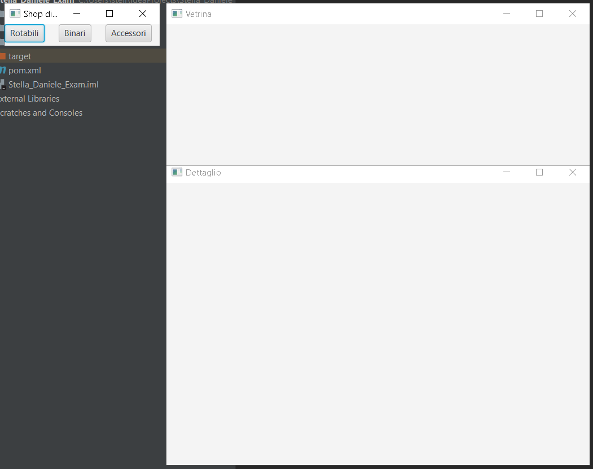
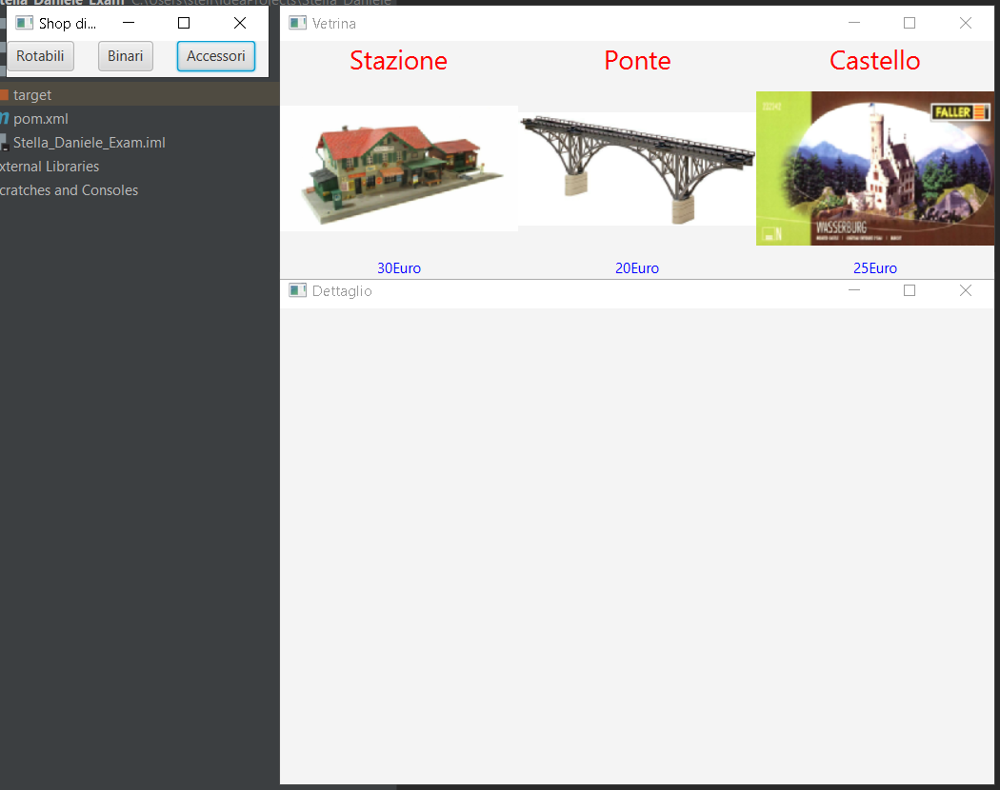
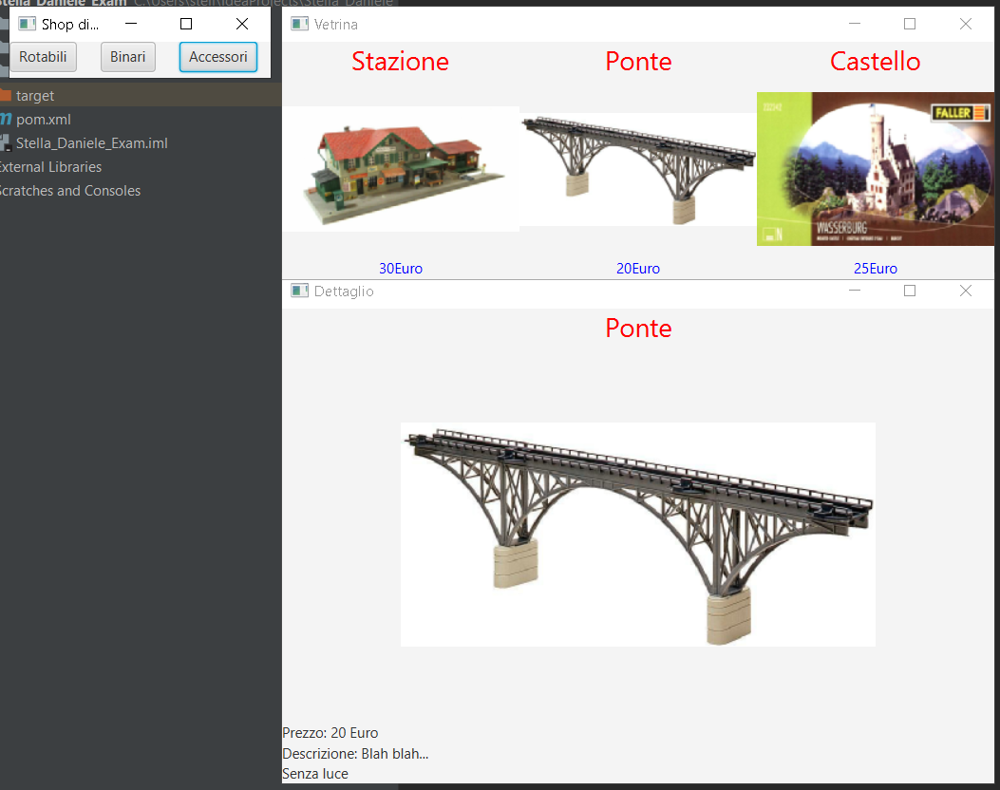

# Programming Languages - module 1

This is the second part of my exam for the course "Programming languages module 1" at UniTn. This module of the course was about object-oriented programming in general, indeed the first part of the exam was theoretical about the OOP. To practice the concepts studied during the course we used Java, also using JavaFX to realize some simple 2D applications. The goal for this second part was to realize a program using Java and JavaFX. 

Grade: 30/30 with honours (maximum score in both parts).

It is a minimal "online shop" with some features listed in the <a href="./CompitoLinguaggiSettembre21.pdf">exam paper</a>.
The exam was not only about programming something working, but to program paying attention to the good practices of the OOP and producing some well-organized code.

The categories can be selected both with the mouse and the shortcut ('r/R','b/B','a/A'). The window does not have to be on focus.

A product can be selected to display its information in the last window.

